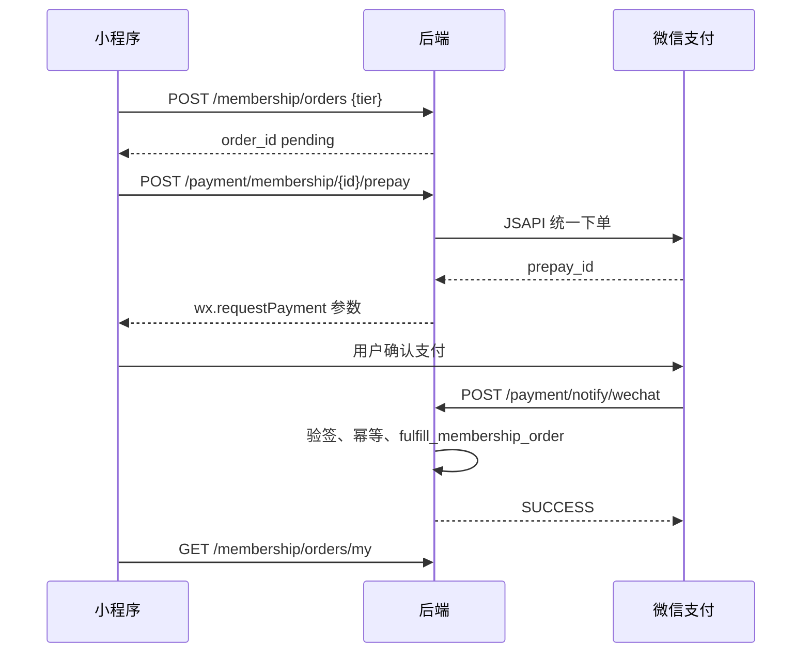

# 企盟 · 上线与微信支付指南

> 从当前「本地演示 + mock-pay」到「真实微信支付 + 小规模上线」的执行清单。  
> 代码骨架见：`backend/app/routers/payment.py`、`backend/app/core/wechat.py`、`backend/app/core/membership_fulfillment.py`。

---

## 一、上线前必备（商务与账号）

| 项 | 说明 |
|----|------|
| 企业主体 | 微信小程序需企业认证；个人主体无法开通微信支付 |
| 微信商户号 | [pay.weixin.qq.com](https://pay.weixin.qq.com) 开通 JSAPI 支付 |
| 小程序 AppID | 与商户号绑定（商户平台 → 产品中心 → AppID 账号管理） |
| API 证书 / APIv3 密钥 | 商户平台下载证书、设置 32 位 APIv3 Key |
| 支付授权目录 | 小程序后台配置（真机支付路径） |
| 服务器域名 | `request` / `uploadFile` / `downloadFile` 配置 **HTTPS** API 域名 |
| 隐私与合规 | 用户协议、隐私政策、收款说明（会费/服务类目） |

---

## 二、推荐技术架构（生产）

```
用户小程序 ──HTTPS──► Nginx ──► FastAPI (uvicorn)
                              │
                              ├── PostgreSQL（推荐，勿用 SQLite）
                              ├── 对象存储（头像/封面，或持久化 uploads 卷）
                              └── 微信支付回调 POST /api/v1/payment/notify/wechat
```

| 组件 | 建议 |
|------|------|
| 数据库 | `DATABASE_URL=postgresql+psycopg2://...` |
| 进程 | `uvicorn` + systemd / Docker；多 worker 时注意 SQLite 不可用 |
| 密钥 | 仅环境变量 / 密钥管理服务，勿提交 `.env` |
| 静态上传 | `/uploads` 挂持久卷或迁 COS/OSS |
| 日志 | 支付回调、订单状态变更单独打 INFO |

---

## 三、环境变量（复制 `.env.example`）

```bash
cp .env.example backend/.env
# 编辑后启动：cd backend && APP_ENV=prod ../.venv/bin/uvicorn app.main:app --host 0.0.0.0 --port 8000
```

关键项：

| 变量 | 作用 |
|------|------|
| `APP_ENV=prod` | 关闭 mock 支付、强制 `SECRET_KEY` |
| `PAYMENT_MODE=wechat` | 走预下单 + 回调（`mock` 仅演示） |
| `WECHAT_APP_ID` / `WECHAT_APP_SECRET` | `wx.login` → openid |
| `WECHAT_MCH_ID` / `WECHAT_API_V3_KEY` | 统一下单与验签 |
| `WECHAT_NOTIFY_URL` | 公网 HTTPS 回调地址 |
| `ENABLE_MOCK_PAY=false` | 生产必须关闭模拟支付 |

---

## 四、微信支付接入步骤（合伙人会费 MVP）

### 4.1 数据与登录

1. 用户表已有 `wx_openid` 字段（启动时自动迁移）。
2. 小程序 `wx.login` 取 `code`，调用 `POST /api/auth/wx-bind`（需已登录）绑定 openid。
3. 未绑定 openid 时，预下单接口返回 400 提示先完成微信授权。

### 4.2 支付流程



### 4.3 后端已实现 / 待你补齐

| 状态 | 内容 |
|------|------|
| ✅ | 订单创建、`fulfill_membership_order`（分润+贡献+角色） |
| ✅ | 预下单 / 回调路由骨架、支付流水表幂等 |
| ✅ | mock 支付仅 `APP_ENV!=prod` 且 `ENABLE_MOCK_PAY=true` |
| 🔧 | `core/wechat_pay.py` 内调用微信 V3 API（需安装证书后实现 `create_jsapi_prepay`） |

实现预下单时推荐官方思路：使用 [微信支付 APIv3](https://pay.weixin.qq.com/wiki/doc/apiv3/index.shtml) JSAPI 下单，或使用 `wechatpayv3` Python 库。

### 4.4 小程序改动要点

1. `utils/api.js` 增加 `payment.prepayMembership(orderId)`。
2. 升级合伙人支付页：`prepay` 成功 → `wx.requestPayment`；失败且 `mode==='mock'` → 走原 `mockPay`（仅开发）。
3. 支付成功后可轮询 `myOrders` 或依赖回调后用户手动刷新。

---

## 五、上线检查清单

### 安全

- [ ] `SECRET_KEY` 随机 32+ 字符
- [ ] `CORS_ORIGINS` 仅小程序后台配置的域名
- [ ] 生产关闭 `ENABLE_MOCK_PAY`
- [ ] 支付回调验签（实现 `verify_notify` 后勾选）
- [ ] 管理接口仅 `super_admin`

### 运维

- [ ] PostgreSQL 备份策略
- [ ] HTTPS 证书自动续期
- [ ] 健康检查 `GET /api/health`
- [ ] 微信回调 URL 外网可达（勿经过需登录的中间层）

### 业务

- [ ] 会费档位金额与商户号费率、合同一致
- [ ] 分润 `pending` → 财务确认 → `paid` 流程与客服对齐
- [ ] 退款/异常订单人工处理流程（当前未自动退款）

---

## 六、分阶段排期（建议）

| 周 | 目标 |
|----|------|
| W1 | 买域名、HTTPS、PostgreSQL、部署 staging；`wx-bind` 联调 |
| W2 | 商户号 JSAPI 通联；实现 `create_jsapi_prepay` + 回调验签；沙箱/1 分钱测试 |
| W3 | 小程序提审、合法域名、关闭 mock；监控与备份 |
| W4 | 月结脚本 cron、运营对账导出；任务托管支付（二期） |

---

## 七、二期扩展（上线后）

- 任务发布 **积分托管** 对接微信支付（冻结/结算）
- 活动报名费
- 微信 **code 登录** 与手机号绑定合并账号
- 分润自动月结 + 企业付款到零钱（需额外资质）

---

## 八、本地仍用 mock 时

```bash
APP_ENV=dev
PAYMENT_MODE=mock
ENABLE_MOCK_PAY=true
```

小程序「我的 → 升级合伙人 → 微信支付（演示）」行为不变。

---

*文档随代码迭代；接口以 Swagger `/docs` 为准。*
