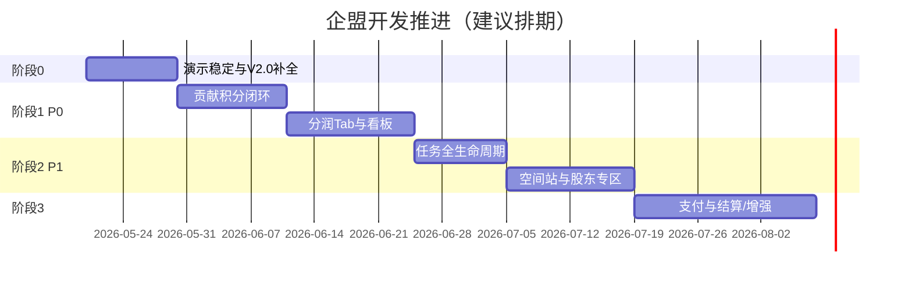

# 企盟小程序 · 开发推进计划

> 依据《企盟_完整设计文档_V2.1_融合版》与当前代码库差距分析编制。  
> 目标：先稳住 V2.0 演示闭环，再按文档 P0→P1→P2 落地 V2.1 商业化能力。  
> 编制日期：2026-05-20 · **状态刷新：2026-06-04**（以代码为准，见 [README.md](./README.md)）

---

## 一、现状基线（2026-06 代码快照）

| 模块 | 后端 | 小程序 | 说明 |
|------|------|--------|------|
| 认证 | ✅ | ✅ | 手机号登录/注册、邀请码、`wx-bind` 骨架 |
| 通讯录 | ✅ | ✅ | 成员、好友、私信、搜索、**活动圈** |
| 任务 | ✅ | ✅ | 广场/承接/发布、交付、四维验收、申诉 |
| 活动 | ✅ | ✅ | 合并在任务 Tab；发起页 `post-activity` |
| 空间 | ✅ | ✅ | 预约、空间站枢纽、超管审核预约 |
| 我的 | ✅ | 🟡 | 档案/信用/钱包/记录详情；钱包「转让/流水」占位 |
| 分润 V2.1 | ✅ | ✅ | **分润 Tab**、看板/流水/引荐/确认 |
| 贡献积分 V2.1 | ✅ | ✅ | 专页、行为触发、兑换消耗 |
| 微信支付 | 🟡 | 🟡 | 预下单/回调**骨架**；演示仍可用 mock-pay |
| 月结/上链/运营后台 | ❌ | ❌ | 阶段 3，未启动 |

**技术栈**：`backend/` FastAPI + SQLite · `qimeng-miniprogram/` 微信原生小程序

---

## 二、规划原则

1. **数据真实**：业务状态以数据库为准，避免前端假数据（已贯彻，后续保持）。
2. **先后端契约、后小程序**：每个功能先定 API + 表字段，再改页面。
3. **可演示里程碑**：每阶段结束应能在模拟器完整走通一条用户故事。
4. **对齐文档优先级**：P0（分润+贡献积分）> P1（空间站+股东）> P2（裂变层级+上链）。

---

## 三、阶段总览

| 阶段 | 周期（建议） | 主题 | 对外可说法 |
|------|-------------|------|------------|
| **0** | 1～1.5 周 | V2.0 演示补全 | 「基础版可验收」 |
| **1** | 3～4 周 | V2.1 P0：贡献积分 + 分润 | 「链接者变现 MVP」 |
| **2** | 3～4 周 | V2.1 P1：任务闭环 + 空间站 | 「空间站样板能力」 |
| **3** | 4～6 周 | 支付、月结、运营后台 | 「可小规模试运营」 |

*周期按 1 人全栈或 1 后端 + 1 小程序估算，可按人力压缩或并行。*

---

## 阶段 0：演示稳定与 V2.0 补全（约 1～1.5 周）

**目标**：现有 5 Tab 无阻断演示，客服/甲方可走通主路径。

### 0.1 缺陷与体验（优先）

- [ ] 任务/活动/空间：加载失败提示、空状态统一（已部分完成，全页复查）
- [ ] 好友申请：重复记录、接受后残留（已修，回归测试甲乙账号）
- [ ] 真机联调：`config.local.js`、合法域名说明写入 `使用说明.md`

### 0.2 社交与名片

- [ ] 名片分享：实现 `onShareAppMessage` + 分享落地页（或分享卡片参数带 userId）
- [ ] 编辑资料：打通 `profile` 与 `cards` API（职务/荣誉/商业版图可先「增删改」基础字段）
- [ ] 邀请：生成带 `invite_code` 的小程序路径；注册时写入 `inviter_id`

### 0.3 任务（仅补关键 UI，完整生命周期放阶段 2）

- [ ] 任务详情页：展示描述、门槛、已报名人数
- [ ] 发布方：「我的发布」进入详情，可查看报名列表（只读）

### 0.4 活动 / 空间

- [ ] 活动发起页（对接 `POST /api/activities/`，权限与后端一致）
- [ ] 空间预约：预约成功列表（`GET /api/spaces/bookings/my`）

### 0.5 我的

- [ ] 钱包充值：对接 `POST /api/v1/credit/recharge`（演示环境可先「模拟充值」）
- [ ] 信用页：对接 `GET /api/v1/reputation/` 流水与等级

**阶段 0 验收标准**

- 甲注册/登录 → 通讯录加乙为好友 → 乙接受 → 双方可见联系方式  
- 甲发布任务 → 乙报名 → 列表与详情正确  
- 乙预约空间 → 我的可见预约记录  
- 分享邀请码注册一个新用户（库里有 `inviter_id`）

---

## 阶段 1：V2.1 P0 — 贡献积分 + 分润（约 3～4 周）

**目标**：对齐设计文档 **第 6 Tab「分润」** 与 **贡献积分中心**，形成「链接者变现」最小闭环。

### 1.1 贡献积分（后端 + 小程序，约 1.5 周）

**后端**

- [ ] 贡献积分 **行为触发器**（在现有路由埋点）：
  - 推荐注册激活 `+50`
  - 好友接受 / 首次完善资料 `+20`（可选）
  - 活动报名 `+10`
  - 任务验收完成 `+20`
  - 付费升级 `+200`（待支付模块，可先管理员手动改 `is_paid` 触发）
- [ ] `POST /api/v1/credit/contribution/spend`：兑换流量扶持/折扣（先做 1～2 种消耗类型）
- [ ] 贡献 ↔ 信用联动（P2 可简化版）：每 100 贡献 → 信用 +1，写 `ReputationRecord`

**小程序**

- [ ] 新建 `pages/contribution/` 或在「我的」内二级页：余额、流水、来源说明
- [ ] `utils/api.js` 增加 `credit.contribution`、`credit.recharge`

**验收**：新用户被邀请注册后，邀请人贡献积分 +50 且流水可查。

### 1.2 分润 Tab（约 2 周）

**产品**

- [ ] `app.json` 增加第 6 Tab「分润」（或阶段 1 末期将「通讯录」升级为「首页」含概览，二选一需产品确认）
- [ ] 页面结构：
  - 概览：今日/本月/累计（`GET /api/v1/profit/dashboard`）
  - 分润明细（`GET /api/v1/profit/records`）
  - 引荐追踪（`GET /api/v1/profit/referrals`）
  - 入口跳转贡献积分中心

**后端**

- [ ] 渠道关系：注册/付费时写入 `channel_relations`
- [ ] 分润 **演示触发**：付费升级、任务成交（验收后 5%）、活动报名（15% 等）写入 `profit_sharing_records`，状态 `pending`
- [ ] `POST /api/v1/profit/records/{id}/confirm`：链接者确认（对账步骤）

**验收**：渠道账号能看到名下引荐人数、至少 1 条 pending 分润、确认后变 confirmed。

### 1.3 三种链接者标识（轻量，约 2 天）

- [ ] 用户表或角色扩展：`linker_type` = 场域 / 资源 / 渠道（或沿用 role + 徽章）
- [ ] 通讯录、名片上展示徽章（股东绿 / 渠道金 / 产业紫）

**阶段 1 验收标准**

- 底部可见「分润」Tab，数据来自 API  
- 贡献积分随注册/报名/任务行为自动增加  
- 客服文档 P0 三条可逐项演示（除真实微信支付外）

---

## 阶段 2：V2.1 P1 — 任务闭环 + 空间站（约 3～4 周）

**目标**：任务成为可交付产品；空间站从「订场地」升级为「区域枢纽样板」。

### 2.1 任务全生命周期（约 1.5 周）

**小程序对接已有 API**

- [ ] 发布方：录用 `accept`、验收 `review`（四维评分表单）
- [ ] 承接方：提交交付 `submit`
- [ ] 双方：申诉 `appeal`（简单原因文本）
- [ ] 状态机展示：applied → accepted → submitted → reviewed → completed
- [ ] 通讯录「互动次数」对接 `InteractionStat`（可选）

**验收**：甲发任务 → 乙报名 → 甲录用 → 乙提交 → 甲验收 → 乙积分到账 + 信用变动有记录。

### 2.2 活动增强（约 3 天）

- [ ] 活动详情页、签到（若后端补 checkin API）
- [ ] 空间站专属活动筛选（`station_id`）
- [ ] 报名贡献积分 + 分润触发联调

### 2.3 空间站 + 联席股东（约 2 周）

**小程序**

- [ ] `pages/station/` 空间站详情：五层收入说明（静态文案 + 动态结算摘要）
- [ ] 联席股东列表（`GET /api/spaces/stations/{id}`）
- [ ] `pages/shareholder/` 或我的内入口：我的股东权益（`GET /api/v1/profit/shareholders/me`）
- [ ] 股东分红记录（`GET /api/v1/profit/stations/{id}/settlements`）

**后端**

- [ ] 四大产品体系：先做展示配置表或 JSON 配置，不必一期全计费
- [ ] 月度结算脚本（管理命令）：生成 `station_profit_settlements` 演示数据

**验收**：打开「北外滩空间站」可见股东名单与结算周期；股东账号看到权益掩码对应说明。

### 2.4 AI 匹配（约 3 天）

- [ ] 通讯录增加「智能推荐」子 Tab 或按钮，调用 `POST /api/v1/ai/match`
- [ ] 展示匹配分、标签、一键发起好友申请

**阶段 2 验收标准**

- 任务端到端无人工改库  
- 空间站 + 股东专区可演示苏里案例叙事  
- 文档 P1 条目可勾选演示

---

## 阶段 3：支付、月结与运营能力（约 4～6 周）

**目标**：从演示走向小规模试运营（依赖商户号与合规评审）。

### 3.1 微信支付（约 2 周）

- [ ] 小程序登录改 **微信 code → 后端换 openid**（保留手机号绑定）
- [ ] 合伙人会费 1万/3万/10万 商品 + 支付回调
- [ ] 支付成功 → 触发推荐人 20% 分润 + 贡献积分 +200

### 3.2 分润月结（约 1.5 周）

- [ ] 定时任务：每月汇总 `profit_sharing_records`
- [ ] 状态流：pending → confirmed → paid
- [ ] 导出对账单（CSV）；小程序「确认」「已发放」展示

### 3.3 运营 / 管理后台（约 2 周）

- [ ] 简易 Web 管理端（或小程序管理员入口）：
  - 用户/任务/活动审核
  - 分润人工调账
  - 空间站股东录入
- [ ] 扩充 `admin` 路由鉴权（角色 `super_admin`）

### 3.4 P2 增强（按需排期）

- [ ] 城市/省/区域合伙人裂变层级与团队分润
- [ ] 分润数据上链存证（`tx_hash` 字段已有）
- [ ] AI 风控：刷分、异常引荐检测
- [ ] 空间站管理后台（四大产品、股东 CRUD、看板）

**阶段 3 验收标准**

- 一笔真实（或沙箱）支付走完分润记账  
- 站长/渠道在后台能核对上月分润并标记发放  

---

## 五、模块与文件建议映射

| 功能 | 后端主要文件 | 小程序主要路径 |
|------|-------------|----------------|
| 好友/邀请 | `routers/friends.py`, `auth.py` | `pages/contacts/` |
| 贡献积分 | `routers/credit.py`, `models/contribution.py` | `pages/contribution/`（新建） |
| 分润 | `routers/profit.py` | `pages/profit/`（新建）+ `custom-tab-bar` |
| 任务闭环 | `routers/tasks.py` | `pages/tasks/` 增详情与子流程 |
| 空间站 | `routers/spaces.py` | `pages/station/`（新建） |
| 股东 | `routers/profit.py`, `spaces.py` | `pages/shareholder/` 或 `profile` 子页 |
| 支付 | 新建 `routers/payment.py` | `pages/wallet/` 或支付中间页 |

---

## 六、风险与依赖

| 风险 | 应对 |
|------|------|
| 微信小程序支付需企业主体与商户号 | 阶段 0～2 用「模拟充值/手动改库」；阶段 3 再接入 |
| V2.0 原文档未纳入本仓库 | 以 V2.1 融合版 + `qimeng_app_v9.html` 原型为准，缺失 PRD 向客服索取 |
| 6 Tab 与现有 5 Tab 信息架构冲突 | 建议：**新增「分润」Tab**，通讯录保持；「首页」合并推荐可放阶段 2 |
| 一人开发并行压力大 | 严格按阶段验收，避免同时开分润+支付 |

---

## 七、建议的近期两周排期（可立即执行）

| 周 | 后端 | 小程序 |
|----|------|--------|
| **W1** | 邀请人写入；贡献积分注册/报名触发；任务详情 API 补字段 | 阶段 0：分享、充值演示、活动发起、信用对接 |
| **W2** | 分润触发（演示）；channel_relations；confirm 接口 | 新建分润 Tab 骨架 + dashboard/records 列表 |

---

## 八、与客服/甲方对齐话术（可选）

> 当前版本为 **V2.0 演示基线**（社交+任务+活动+空间+我的）。  
> **下一步 4～6 周** 交付 V2.1 P0：贡献积分自动记账 + 分润 Tab + 引荐追踪。  
> **再 3～4 周** 交付 P1：任务验收闭环 + 空间站股东专区。  
> 微信支付与月结分润属 **第三阶段**，需商户号与合规配合。

---

## 九、文档维护

- 每阶段结束更新本文件 checkbox 与 `使用说明.md`
- API 变更同步 Swagger：`http://127.0.0.1:8000/docs`
- 重大表结构变更在 `backend/` 增加迁移说明（当前为 SQLite 直改，上线前建议 Alembic）

---

*本计划随迭代更新；以仓库 `docs/开发推进计划.md` 为唯一推进清单源。*

---

## 十、AI 分步执行手册

若使用 Cursor 等 AI **分多次**完成开发（先数据库、防假数据、每步一条提示词），请使用：

**[AI分步开发指南.md](./AI分步开发指南.md)**（含 S01～S18 可复制提示词与验收命令）
